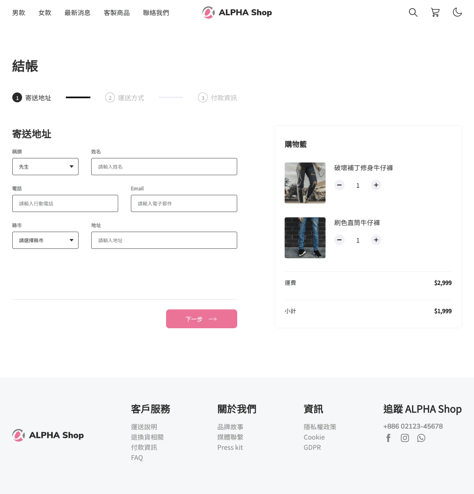

# ALPHA SHOP

此專案為 React 操作練習。

</br>

## 專案畫面



<br/>
<br/>

## 環境建置

- react: 18.2.0
- react-scripts: 5.0.1

<br/>
<br/>

## Installing - 專案安裝流程

1. 打開終端機，下載此專案。

```
git clone https://github.com/JamieLoLo/alpha-shop.git
```

2. 進入專案資料夾

```
cd alpha-shop
```

3. 啟動專案

```
npm start
```

4. 專案網址位於

```
localhost:3000
```

5. 退出專案可使用以下快捷鍵

```
control + C
```

</br>
</br>

## 專案開發人員

<a href="https://github.com/JamieLoLo">Jamie Lo</a>
